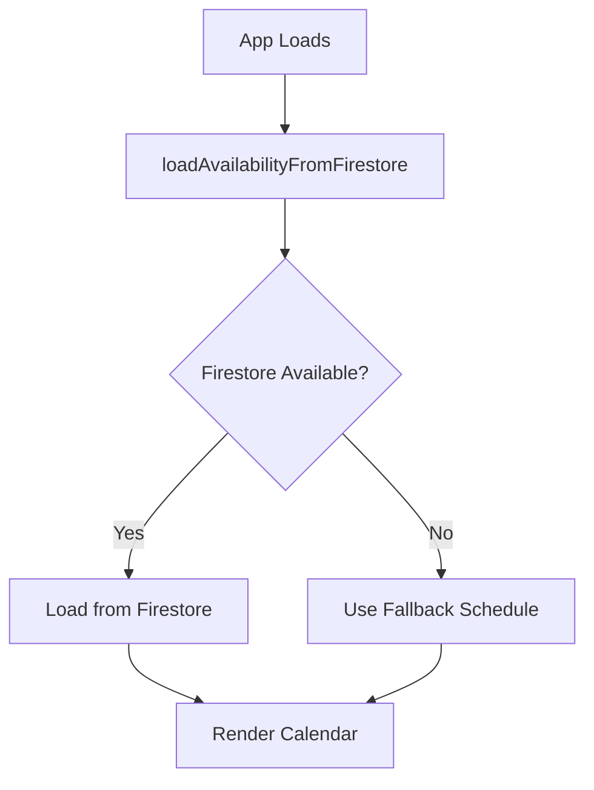

# Availability Schedule Setup Guide

## Overview

The booking availability schedule has been externalized to Firestore for easier updates. This allows you to modify consultation hours without changing code or redeploying the application.

---

## Current Schedule

- **Monday:** 3:00 PM - 4:00 PM
- **Tuesday:** Closed
- **Wednesday:** 3:00 PM - 4:00 PM
- **Thursday:** Closed
- **Friday:** 10:00 AM - 12:00 PM, 3:00 PM - 4:00 PM
- **Saturday:** Closed
- **Sunday:** Closed

---

## Initial Setup (One-Time)

### Step 1: Deploy Updated Security Rules

The Firestore security rules have been updated to allow the config collection. Deploy them:

**Option A: Firebase Console** (Recommended)
1. Go to https://console.firebase.google.com/
2. Select project: `natzconsul`
3. Navigate: Firestore Database → Rules tab
4. Copy content from [`firestore.rules`](file:///c:/Users/user/.gemini/antigravity/scratch/edu/firestore.rules)
5. Paste into Firebase Console editor
6. Click **Publish**

**Option B: Firebase CLI**
```powershell
cd c:\Users\user\.gemini\antigravity\scratch\edu
firebase deploy --only firestore:rules
```

### Step 2: Initialize Availability Schedule

**Option A: Using HTML Setup Page** (Easiest)
1. Open [`setup_availability.html`](file:///c:/Users/user/.gemini/antigravity/scratch/edu/setup_availability.html) in your browser
2. Click "Initialize Schedule in Firestore"
3. Wait for success message

**Option B: Using Node.js Script**
```powershell
# Note: This requires Node.js environment setup
node init_availability.js
```

---

## How It Works

### Application Flow



### Code Changes

**1. app.js - Dynamic Loading**
```javascript
// Availability is now loaded from Firestore on app initialization
let AVAILABILITY = { /* fallback schedule */ };

async function loadAvailabilityFromFirestore() {
    const availabilityRef = doc(db, 'config', 'availability');
    const availabilityDoc = await getDoc(availabilityRef);
    if (availabilityDoc.exists()) {
        AVAILABILITY = availabilityDoc.data().schedule;
    }
}
```

**2. Firestore Document Structure**
```javascript
// Collection: config
// Document: availability
{
    schedule: {
        0: { ranges: [] },              // Sunday
        1: { ranges: [[15, 16]] },      // Monday
        2: { ranges: [] },              // Tuesday
        3: { ranges: [[15, 16]] },      // Wednesday
        4: { ranges: [] },              // Thursday
        5: { ranges: [[10, 12], [15, 16]] }, // Friday
        6: { ranges: [] }               // Saturday
    },
    lastUpdated: "2026-01-20T...",
    version: "1.0"
}
```

---

## Updating the Schedule

### Method 1: Firebase Console (Recommended)

1. Go to Firebase Console → Firestore Database
2. Navigate to: `config` → `availability`
3. Click **Edit document**
4. Modify the `schedule` field
5. Click **Update**
6. Changes take effect immediately (users will see new schedule on next page load)

**Example: Add Saturday hours (9am-11am)**
```json
{
  "schedule": {
    "6": { "ranges": [[9, 11]] }
  }
}
```

### Method 2: Programmatically

Create an admin script or use Firebase Admin SDK:
```javascript
await setDoc(doc(db, 'config', 'availability'), {
    schedule: { /* updated schedule */ },
    lastUpdated: new Date().toISOString(),
    version: '1.1'
});
```

---

## Time Format Reference

Hours are in **24-hour format**:
- `9` = 9:00 AM
- `10` = 10:00 AM
- `12` = 12:00 PM (noon)
- `15` = 3:00 PM
- `16` = 4:00 PM
- `17` = 5:00 PM

**Example Ranges:**
- `[[9, 12]]` = 9:00 AM - 12:00 PM
- `[[15, 16]]` = 3:00 PM - 4:00 PM
- `[[10, 12], [15, 17]]` = 10:00 AM - 12:00 PM AND 3:00 PM - 5:00 PM

---

## Fallback Mechanism

If Firestore is unavailable, the app uses a hardcoded fallback schedule (same as current schedule). This ensures the booking system continues to work even if there are connectivity issues.

---

## Testing

After initialization:

1. **Verify in Firebase Console**
   - Check that `config/availability` document exists
   - Verify schedule data is correct

2. **Test on Website**
   - Open your website
   - Open browser console (F12)
   - Look for: `✅ Availability schedule loaded from Firestore`
   - Click "Book A Consultation"
   - Verify correct days show availability dots

3. **Test Schedule Update**
   - Modify schedule in Firebase Console
   - Refresh website
   - Verify changes are reflected in calendar

---

## Troubleshooting

### Issue: "Permission denied" when initializing

**Solution:** Deploy updated Firestore security rules (see Step 1)

### Issue: "No availability schedule found in Firestore"

**Solution:** Run the initialization (see Step 2)

### Issue: Schedule not updating on website

**Solution:** 
- Hard refresh browser (Ctrl+Shift+R)
- Check browser console for errors
- Verify Firestore document was actually updated

### Issue: Fallback schedule being used

**Check:**
- Browser console for error messages
- Firebase Console → Firestore → config/availability exists
- Network connectivity

---

## Benefits of This Approach

✅ **No Code Deployment** - Update hours without touching code  
✅ **Instant Updates** - Changes reflect immediately  
✅ **Centralized Management** - Single source of truth  
✅ **Fallback Safety** - App works even if Firestore is down  
✅ **Version Control** - Track changes via lastUpdated field  

---

## Next Steps

1. ✅ Deploy updated Firestore rules
2. ✅ Initialize availability schedule
3. ✅ Test booking flow
4. Consider: Create admin panel for schedule management
5. Consider: Add email notifications when schedule changes
